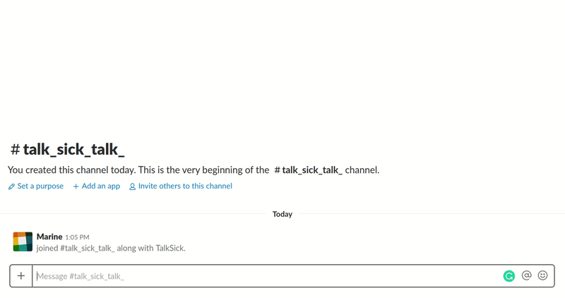

# TalkSick

Violence in social media is something that we all deal with on a daily basis, and I would love to see less off it on my screen.

This is a project I did at Metis data science immersive program.
My motivation for this project was promoting a positive approach to minimize intentional and unintentional violent conversations taking place online by classifying toxic comments in social networks.

And so I built a user-friendly and reasonably **smart Slack bot that warns users and suggests to reconsider their words**.

## Data

I used Toxic Comment Classification dataset from Kaggle to train a model.
You can fetch the dataset [here](https://www.kaggle.com/c/jigsaw-toxic-comment-classification-challenge/data). 
I used Fasttext word embeddings:

* [FastText crawl 300d 2M](https://www.kaggle.com/yekenot/fasttext-crawl-300d-2m)

